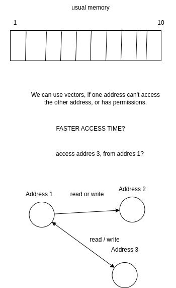
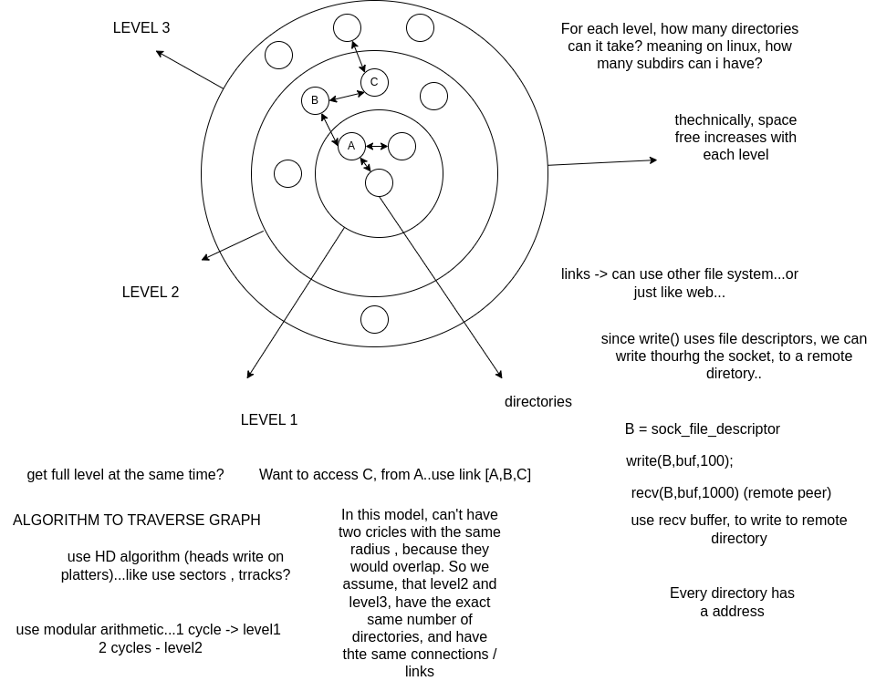
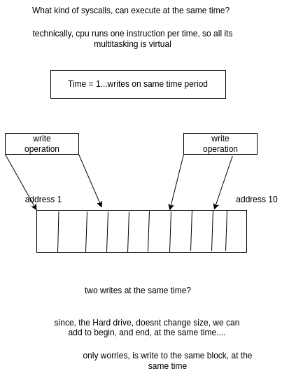
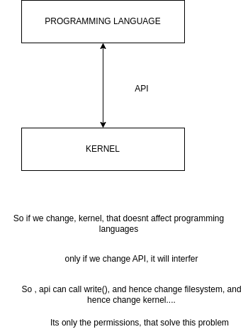
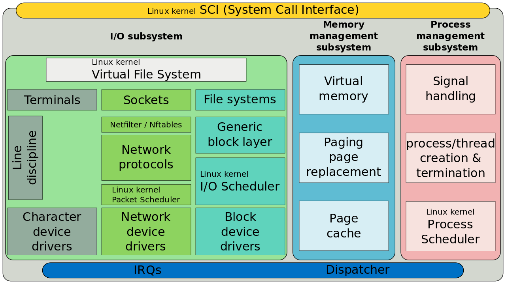

# Theory used
the underscore is free space
the slot is a place , with a size (a block of memory, a cell)
Inside bars, is the data occupied
Slot 1
| 3 | -> 3 is on slot 1

sum is a allocation...say

| 3 + 2 | -> allocation of two bytes in slot...

#### Why is memory sequential ?  a ordered list?

why not a graph? faster speed, to access addresses...say address 7 from address 1

if i have dir1/dir2/dir3, if i delete dir2, i also delete dir3...
get inode, and change filename (use a filename on inode...possible in the future?)

### what is ls / find performance using directories or inodes

### Chat gpt
A directory in Linux is essentially a special kind of file that contains mappings of filenames to inode numbers.
### End chat

### Inodes (that refer to files) -> can be directory ? instead of having directories, have one inode?
So we can use inodes, to behave as directories?

ls -> since the filesystem, will not be a tree, how to do ls ? just use 
command "ls dir" ...for each dir we want to list...

if, we assume that only inode list, and they have a filename on the structure, then ls, just lists inode filenames....

what about find? same thing. if inode filenames is used, just get that..
find would use inodes, because find, a part of returning path (which basically is a name), it uses types, and timestamps ...say, for example
"find . -type d" (object  is a directory...)

every time i need a filename, i need to cycle through inodes..not if we use a directory, which is a single entry, that has filenames.

so performance, must be dealt with.Use a fast algorithm, to get filename from inodes. And compare that filename with the filename that the command is using.

### Normal behaviour   

slot1 slot2 slot3
| 3k | 2k | 3k 

   buffer to write 3k on slot 2

   buffer exceed slot2?
   para saber se buffer excede, aceder a slot3 e se nao completar, excede , get another slot

   if its filled with 10, and 10 is the size of slot.

   |10 | 2 | 10 | 5.

total space = 40 (| 10  | 10 | 10 | 10 )

total free space = 40-27 -> (27 is given by Sum all cells...(10+2+10+5)
 total = 13 free space...

Say we want to store, 50 units. have free space 13, so can't write it to memory...

use matrix say, columns = 4 , rows = 2..instead of just one row...

   |10 | 2 | 10 | 5. 
   | 7 | 10 | 9 | 2   ----> many rows...

   |10 | 2 | 10 | 5 | 7 | 10 | 9 | 2 -> single row...

#### Cant divide ..because 10+3+7+10 = 30, and dividing by block size, (10), gives us 3, which is not the free space

  3_Slots (| 10  |  7 |  10) equals 27

  27 / 10 = 2 (two cells occupied ), reminader = 7, that is on slot2.(7 is allocated on cell 2)

  | 3 | 10 | 3 | 6

  22 / 10 = 2, cells, 2 remainder.

   | 10 | 10 | 2 |

   To defrag. (also, check overflow below..)

For | 3 | 5 | 10

18 / 10 q=1, (one cell full), 8 occupied space.

#### End can't divide	

   What are the slots, that has have free space.
                             
   pos7                      pos1

   |10 | 7 | 10 | 4 | 3 | 9 | 3
    
    
   7 * 10^6 + 4*10^4 + 3*10^3 + 9*10^2 + 3*10^1 = 7043930

   start count at 3 

   7 is at position 6

    
   What are the slots, that are full? to subtract
    
   | 0 | 7 | 0 | 4 | 3 | 9 | 3

   assign zero to full slots (ones that have 10), and get the number...

   Use the number (in this case 7043930, to know how much slots, have free space on it)

   4 KB = normal block size of ext3.

		
		   10 	   3		10
		   
	a)	| First | Second  | Third
	
	
   23/10 q=2 r=3 (two full slots, and remainder 3)

   10+3+10 = 23, então second has free space (7) 10-3 (for all slots full, must be 10+10+10, so in 2position is 3 , the extra space is 7)		 

   #Overflow

   overflow, either in same slot, or next slots...

   | 3 + 5 | -> overflow of 5

   | 7 + 5 | -> overflow of 2, and considers next slot.

   so

   | 10 | 2 | ...next slot = 2.

   From a overflow, point of view, doesnt matter if there is a space left or right in slot...
   e.g

   | 3 _  | 4 _  | 7

   overflow of 11

   |3 7 | 4 4 _  | 7

   equal to

   | 3_ | _4 | 7

   get the number, that overflow, and start at any position..must go to right though

   say

   | 3 | 13 | 4

   overflow goes to right (where 4 is) . number that overflow = 3...so third position gets 7.

   Say i have 43 to write.depends on what is there...

   | 10 | 7 | 10 

   start at position 1 or 2 or 3.

   start at position 1

   | 10 | -> already full , get next slot
   | 7  | -> 3 units to fill , overflow went from left to right
   | 10 | -> Taken...next slot.

   overflow, dependant on full slots.

   | 10 | 7 + 3 | 10 , overflow = 20 (wasted 3)

   on position 2, waste 3..say we have number to overflow = 23...subtract 23 -3 , same algorithm , less overflow.

    
   from left to right

   | 5 | 9 | 3 | 4

   overflow = 23

   start at position 1.

   subtract 23 with 5...18 . overflow = 18 ..go right or left?
    
   position 2
   subtract 18-1 = 17

   position 3
   17-7 = 10

   position 4
   10 - 6 = 4

   next slot, is empty , so overflow finished

   slot1   slot2
  |  3   |  4    |  ...how to distribute overflow ?  ,right to left, or left to right.

  | 7 ___ | ____3  | 2___ -> overflow the same (either free space at left or right)

    
   What happens, if overflow? Does the next block gets overwrite, or shifted to the right 
    Doesnt matter, overflow, is not dependant on free space from left or right

		
		
		7 ___ | SECOND | THIRD
		
		| ___ 7 | SECOND | THIRD

        | 3___4 | SECOND | THIRD   -> Can't happen, because that divides the slot in two. (on left 3, on right 4)

        

		You can allocate, memory, if data to write, less or equal free space on slot. In this case if data to write <= 3.
		

		
        
            To know if overflowed

            | 3 | 7 |

            overflow, must be at least 8

            next slot, (assuming we are going right) overflow = 1, On slot 7. New number 8

            | 5 | 4 |

            Start overflow on position 2 (4)

            overflow 18.

            overflow = 18-4 = 14

            slot 1      slot 2    slot 3
            | 5 + 18    | 10     | 3 + 14

            To get overflow. you sum each slots, with the overflow. At the same time,  you subtract from overflow
            overflow a) used = sizeofBlock - number that it was before 
            overflow = overflow - a)

            To know if it overflowed, have number on first slot (the slot we choose, to begin our overflowed process),
            say

            | 7 |, and have a overflow of 7.

            7+7 = 14, bigger than 10 , overflowed.

            

### Question 
     
     ---- use biwise operations to shift from left to right or inverse	---
			
                overflow = 2 
				3 + 9 | 3 | 
				       
                        shift 2
				| 10 | ___ 3    In this case, from left to right

                | 10 | 3 ___    doesnt shift right.

                So , we can use the normal overflow, and second slot, will be

                | 10 | 3+2 __ |

	 -----------------------------------------------------
	
    Is overflow, the same as shift it ,on some position?

### End question
			
Allocation
    Memory is allocated in blocks, so, we can't have
        2 | 8 , (and say that 10 spawned through block1 and block2)                        	

        if number <= 10 (block size) - 2(what is already on block) , then we can allocate a block.
        else, the operation, gets discarded..free space, smaller than user space...

	Only if we see it, as a single block, as in 

    | 2 7 1 3 5 |		

Have

| 3  |  8  | 10 | 5

freespace = 16 ...data to write, 9

| 3 + 9 | 8 | 10 | 5

first slot, 12, so overflow = 2

| 3 + 7 | 8+2 | 10 | 5

### Free space
how can i get free space..use overflow concept?

want to release 12 free space

| 7 | 3 | 4

free space = 3+7+6 = 16

want 

| 10 | 10 | 6

oveflow= 16..

### More real

    | Slot A  | Slot B

    Want to allocate 6k
    A -> 4k , fully allocated
    B -> 4k+4k - 6k
    So Slot B, gets allocaed 2k

    What if on slot A, we have already 2k occupied? Normally, we would use any other slot.

    We can use overflow, as above.

    For that we need memory, as a single list

    | slotA slotB slotC slotD | , etc....

    To use on normal pc's, can we assign addresses, so that is linear, and sequential? like

    | slotA slotB slotC slotD |
    addr1 addr2   addr3  addr4
    
    does virtual memory, does this?

#####  On a normal scenario.

	| Slot A | Slot B | Slot C
	
    Slot A,B,C are empty.

    To allocate , 7 k

    4k+4k+4k = 12k  -> Free space is 12k

    12k - 7k = 5k  -> remaining free space ,after allocation.

    One slot free (B, with 4k), and 1k of slot C free.

    

 #### IMPORTANT, if you will use a real case scenraio, like 4k for pages, substitute that by number (im using 10 as the block size)

	
		
## Example for allocation

	if bytesToWrite > first, and bytesToWrite > second, and overflow still exists, and is less than third slot, memory filled.

			
        Slot A    Slot B   Slot C
	|3 __    |  2 |  __ 7
	
    If i overflow slot B, will it go to left or right of it?

    overflow = 9 , left or right 1 (2+9 = 11, blocksize = 10 )

    Slot A , free space = 7 (counting from left)
    Slot C , free space = 3 (counting from right)

    left

        |3__ 1 | 10 | ___ 7

	right
        | 3___ | 10 |1 __ 7
	
	### I can move bytes from left to right or vice versa

        | ___ 3  | 10 | ___ 7

        i can move, 3 to the left

        | 3 ___ | 10 | ___ 7

	if the number is less than the block, then introduces spaces. Either | 3 ___ | or |___3| 
    
    you can choose, either free space, left or right....

If there is no overflow, (meaning cell, has a number, and allocation of another number is smaller, than block size)
	we can choose either 

    | 3__  | 5

    to allocate -> 6 

    | 3 + 6 _ | 5
    
    | _ + 3 + 6 | 5

    We can shift...(using bitwise operators?)

    On a overflow:

    | Slot 1 | Slot 2 | Slot 2 Slot 3|

    Can't shift from slot2, because slot 2 is full.

    If we want, to have

    | Slot 1 | __ Slot 2 | Slot 2 Slot 3|

    We can left shift slot 2, to left. Wither the number of shifts, fill a slot, it decreases numbers on slot 3

    | Slot 1 | Slot 2 | ____ Slot 3|

    Shifted slot2 for example

    | 3 | __ 5 | 3 + 6 |

    shift left, can shift left, 5 positions...How many does it needs to have  shift, at least?
    
    In this case, needs 3 shifts left

    So we got

    | 3 | __ 5+3 | 6 |
        
       free space = 2 , on slot 2.

### Method for allocating, same number , diffent order , which one to choose?
										
			2 | 8, (free space 2)|  
			3 | 7,  (free space 3)
			
			ok, if i use bigger numbers, the free space will be smaller
			
			free space on slot2 (considering 7), bigger than free space on slot2 8 (considering 8)
			
			Same number (in this case 10, spawned through block1 and block2)
			
			block1  = 10-2 -> 8 (8 is on second slot)
			block2  = 10-3 -> 7 (7 on second slot) 
##### So choose slot 1 to write 10. More free space...

#### Why use a tree, with directories?

why does a child node, has to be created on a parent node? why is it a tree?
say

dir1...create dir2
dir1 / dir2

why not just use dir2?

good for "finding", files..we can convert the new structure, to tree, if needed.

doesnt traverse the path...

#### End tree

Hard link -> same inode , same file

#### Other aspects

On a crash, (for example on ext3, we lose data, if a drive would crash), couldnt the kernel empty its buffers? or ext3 buffers?
Perhaps a interrupt from kernel to filesystem?

Good thinking, flush buffers of kernel on crashing , and flush buffers of ext3 as well...

What if the data to write, is very big? can't flush it.

get alls file sizes, from inodes...if ok, flushes them all...

can i access inodes from normal user (not root)

### Increase hard disk performance..can kernel do it? instead of say, saving free blocks, on another structure? instead of bitmaps?

Can the kernel use other structures (as in struct in c , keyword), smaller, to increase performance?
Or faster algorithms?
Are the algorithms that use memory, on the kernel level, or filesystem level?

faster cpu performance -> faster file system..
Or kernel performance faster -> faster file system.

What is the advantage, of reordering , the order of writes ? 
say instead of write 1,2,3,4,5

write 3,5,1,2,4?? 

because of fragmentation? from a HD point of view, is worst, if write is non sequential....

The fsync() syscall is used to flush the file data and metadata to disk

#### HD write

can threads use write() call, and have the same performance as kernel?

is it the same function (exactly same bytes?) in thread and kernel?

what about other concept to write to HD? a determinated like-thread..like executor (used for example in network write()...can by any name)..

what about writing to the HD with pointers?
char *ptr = Address Of HD? (statement of c programming language)

For pointers to work, it allocates space on RAM. What if RAM is mapped to Hard drive? (like mmap() for example)
Point is, c doesnt specify, if pointer, is stored on HD, or RAM...

What if we increase the platter RPM ?  better performance for HD memory?

Do we need a physical head?

Say, a man is writing on paper. He's using a pen. What else can be used? like old printer needles...

### Chat gpt
There is no universal "best" material for RPM; the choice depends on the application’s specific needs. For extreme high-RPM scenarios, carbon fiber composites, titanium alloys, and ceramics stand out for their ability to handle high stresses, minimize weight, and resist wear and heat.
### End chat gpt

### Physics of it

check circular motion (physics)...is it a force, that is in the origin of motion?! so bigger force, faster the movement?

circular motion, is motion, that is applied a centripetal force ,so bigger the centripletal force, the faster it rotates?

$F_e = \frac{mv^2}{r}$

m -> mass
v -> tangential velocity (speed along the circular path),
r -> is the radius of the circular path.

$F_e * r = m*v^2$

If r , equals mass, 

$F_e = v^2$

Make the hardrive, with radius = mass, if you we just want to use $F_e$

so, to increase speed...less radius, bigger mass (compared to same radius), or bigger force...

##### Physics note : Bigger mass, bigger the velocity...

##### chat gpt
A higher frequency means the memory can perform more operations per second, resulting in faster data transfer.

##### end gpt

This is not true, its a measure.

a frequency, is a measure, not the actual factor , that does the ram speed or binary storage. So what causes the frequency ? On  my other docs, i wrote, that the origin of wave, is a force. 

##### Chat gpt
The clock signal is typically a square wave that synchronizes DRAM operations, while the data signals transmitted through the memory bus can be understood as voltage waves moving through the system at high speed, especially in high-frequency DRAM like DDR4 and DDR5.

##### End chat

so on, HD, we are left, with storing bits. Why can't we store bits, like DRAM does? or read bits from HD? 

Can we use RAM constructs, on HD drives?
like data signal from RAM to HD drive?

##### chat gpt
A higher frequency means the memory can perform more operations per second, resulting in faster data transfer.

##### End chat
This is not true, its a measure.

a frequency, is a measure, not the actual factor , that does the ram speed or binary storage. So what causes the frequency ? On  my other docs, i wrote, that the origin of wave, is a force. 

##### chat gpt
The clock signal is typically a square wave that synchronizes DRAM operations, while the data signals transmitted through the memory bus can be understood as voltage waves moving through the system at high speed, especially in high-frequency DRAM like DDR4 and DDR5.

##### end gpt

so on, HD, we are left, with storing bits. Why can't we store bits, like DRAM does? or read bits from HD? 

Can we use RAM constructs, on HD drives?
like data signal from RAM to HD drive?

If we take, the heat stuff, we can have non cooling systems.

If there is no, energy transfer, there is no heat

##### chat gpt
Heat is the transfer of energy resulting from the movement of atoms and molecules within a substance. It can be transferred through conduction, convection, and radiation

##### end chat

how does the heat tranfer / move?
does it transfer from one point to another, or just move?
convenctions
Heat transfer occurs via the movement of fluids (liquids or gases)

Doesnt matter to us

Radiation: Heat can be transferred without a medium (such as air or water) through electromagnetic waves,

doesnt matter,

so we are left with conduction.

Conduction: Heat is transferred through direct contact between particles

ok we need to avoid this.

If there is no direct contact between particles, there is no conduction? 

If so, no energy transfer , no heat.

Temperature is a measure of the average kinetic energy of the particles in a substance. 

What are the directions of kinetic energy, on a body, Do they anull some of them?

##### chat gpt
Heat refers to the transfer of energy from one system to another due to a temperature difference. 

##### end chat
So if dont have temperature difference, there is no heat...

say, increase temperature on ,some chip. no heat will 

use heat equation, and one zero on it

𝛛u / 𝛛t is the rate of change of temperature with respect to time.

𝛛^2u / 𝛛^x^2

x -> space
t -> time ...different equations...

$\alpha$ is the thermal diffusivity, a material property that measures the rate at which heat diffuses through the material.

If that's zero, no heat...

$\alpha = \frac{k}{𝛒*c_p} $

k -> thermal conductivity
𝛒 -> density of material
$c_p$​ is the specific heat capacity (how much heat is required to raise the temperature of a unit mass of the material).

$\alpha$ is the thermal conductivity, for it to be zero, k, must be zero.

density, and heat capacity, can't be zero.

### End physics

### Peripherals

performance?! what about USB, tape drives...should ext3 be used, or other file system (usb storage capacity, is smaller than HD)
to improve performance?

#### What type of buffer?

What kind of buffer?! how large the buffer? all HD's are different, so the ext3 is optimized for them all? how many bytes do we put on the buffer?!
should ext3, be optimized for each brand HD?

### Differences between classes and files

files can have type....so do classes
files can have properties...so do classes
a file can be in memory, or in HD...class must be in memory 

So class = file in memory

in Java, we need to call java runtime ("java" command) . On files, we need the kernel to execute (on linux is execve)..we can choose to just run some funcitons of files...

file types = {text,binary}
properties = { size,executable,read only }

file type "text" subset of type "number" :
	for example number = [1,2,90,152,123,123]
			   text  = [0x12,0x21,0x61 ] (ascii values)

file type "text" subset of "data" , subset of binary data, subset of number...

file type "binary" = type number

a binary can have strings, because text is subset of number...

### Cpu doesnt make difference
type of data [ascii, "ABC" , 0x41 )
properties if data = "understood, and assumed by people"

### CHECK	
check new language/properties_and_types.odt
### END CHECK

### allocation

allocation -> way to reserve space on memory.
Any file system, that is a block allocator, can be used....

like pointers in c 
char *ptr;

say *ptr = address of data block

*ptr =  1

### Problem free block list -->  update inode...

If i use, pointers, we need to take into account the free block list
If we upgrade the free block list then , we can use pointers....meaning we update inodes.

So use pointers, and update inode's pointer to the data block. Increased performance...
### End problem

doesnt matter if it is on memory or hard drive.
Same for file system. Everything is a file. How that file is accessed / modified, is function of filesystem.

Can we have two file systems? Yes, on linux, you can mount any file system.

after allocation, well be using two or more write calls, that are mostly, at the same time..say nanoseconds ..hardware wouldnt perceive it.

get free space (calculate ...see above, or )

| 6 + 2 |     | 4 + 2 | 

what about allocating overflow

| 6 + 1 | 4 + 2| 

calculate overflow number...in this case 2 , free space = total on slots  - written data  

total = 6+4
written data = 4

free space = 6

### Get value from slot..in this case 9
|   9   | 
| 01001 |

OR slot content (in this case 9) with 11111
so 01001 OR 11111 = 9

#### Large files...
Problems with file system, writing large files

why hold the writing until we have more data ? wait for write() to finish, performance issue? 

Use several write syscall, at the same time...

### Do we need to change programming languages?
for pointers to work (write on HD , char * ptr = 0xaabbcccd, e.g) ,
 c doesnt consider, if its a HD or RAM. So we can use any type of memory, and c will still function.
 Its compatible, with many programming languages...

Universal API -> kernel API..used by everything...

### Buffers

what kind of buffer?! how large the buffer? all HD's are different, so the ext3 is optimized for them all? how many bytes do we put on the buffer?!

On programming language we have, sequential variables
example

char buf[20] -> position  1 to position 20.

So, kernel , uses write() / pwrite() / fwrite() syscalls everytime to write data to HD. So write, is capable of using megabytes in buffers?

Where do i store , those megabytes? on RAM ?? because buffer, is on RAM.

i need a (on c , just an example)

char buf[0xffffffff]; (int)
char buf[0xffffffffffffffff]; (long long)

only possibility is a long long, which is 8 bytes. so we need several buffers, to save megabytes ?

lseek, uses a buffer,or complete file is on lseek buffers? you need to have variables, with a determinated size, to hold the data (buffers most likely)

Everything , that writes() / reads() to file system, is using a buffer?

lseek, uses sequential order (thats the user prespective, that the file has sequential data...lseek() only works, after kernel writing)
[1,2,3,4,5 ] -> lseek

lseek, must wait for kernel, writing, because it doesnt know what slots to use. 

#### Shift between arrays

buf[3]  = buf[7...10] ---> SHIFTS?

assigning, is performance, good, we only need to assign indexes...What about if 

| buf[3] | buf[many megabytes] 

i want to put it on buf[3]..use division algorithm above

#### Flush , if a system crashes, it send a signal to the filesystem to flush the buffers (can this be a kernel function, like fsync();)
a memory region, on the memory infrastucture, that gives the size of the file?

What if the size to flush is big? but kernel  functions , like read() / write(), use buffers...

say megabytes on file
	char buf[4096];

if the buffer is bigger, better performance?

Can't flush buffers...there isnt any..write keeps writing to fill its buffer...so only knows buffer, not file contents or size...

#### Problems on file systems
Writing / Reading large files
performance
security...

#### Shared Memory
shared memory, using ext3? can we use HD with shared libraries?

filesystem , is shared memory...everyone can access it, and , in theory, at,  the same time...

filesystem , same problems ,as shared memory, what was made (what kind of algorithms were used), to deal with shared memory?
  
#####  Map memory to HD
mmap, munmap - map or unmap files or devices into memory

What about mapping memory to HD ?

#### Programming languages
for pointers to work (write on HD , char * ptr = 0xaabbcccd, e.g) , c doesnt consider, if its a HD or RAM. So we can use any type of memory, and c will still function. its compatible, with many programming languages...

c runtime (or compile time, say a character array..or runtime , as in malloc()), allocates space on RAM. What if RAM is mapped to Hard drive? nevermind C, doesnt specify either is on RAM or HD..so ..we can use pointers.

so , if we had non contigous RAM memory...what do the kernel do?!

can we use lseek(), since its implemented in c, meaning, doesnt matter, if its the hard drive or ram. Unless , it calls other API...

So can, we use files functions (like lseek()) on RAM? if they use C , its probable, dependant on APi calls, made from them.

### Sequential data
from the kernel prespective, it writes non sequential. After the write, it must assure, that the data is available sequential. lseek(), can only be used, after the kernel writes the data. (because it assumes sequential data)

So kernel allocate ,4,3,5,1,2 

from a user presepective writes 1,2,3,4,5 (after kernel finishs writes())

outcome = 1,2,3,4,5 for kernel and user. (after all data has been written by kernel)

[1,2,3,4,5] -> User wants to write that

[3,4,1,2,5] -> Kernel buffer (needs one, to write)
[1,2,3,4,5] -> Hard Drive file system after writing.

its a slot, problem. so slot [1] => 3
				slot [2] => 4
				slot [3] => 1
				slot [4] => 2
				slot [5] => 5
				
			     
if data, equals to positions...say
	byte data 1 , byte data 2, byte data 3
	position 1 , 2 , 3...

byte = position. Then  just write positions...

positions written order = {slot3,slot4,slot1,slot2,slot5}
data to write {1,2,3,4,5}

Slot 1   Slot 2   Slot 3  Slot 4  Slot 5	
|  3   |    4     |  1    |  2     |   5  |

so kernel writes two times, to get sequential, or it happens on RAM (the ordering) 
It can't write non sequential data, to HD. User needs to have sequential order (this must happen, after kernel write)..,
## RAM

Slot 1   Slot 2   Slot 3  Slot 4  Slot 5	
|  3   |    4     |  1    |  2     |   5  |

## ON HD, after write

Slot 1   Slot 2   Slot 3  Slot 4  Slot 5	
|  1   |    2     |  3   |  4   |   5  |
 

### Filesystem unit
A object (any object) must be resident on Filesystem, to be called a file	

is ELF , related to ext3 (on linux). No is just a file specification

what is a file ? executable, and non executable data ?! its a block of data, referenced by inodes, and those inodes, have metadata, about the file.

file = {executable,non-executable}
executable = {elf,python scripts and all other scripts that can be run}. 
c text file = {Non executable at first, but once compiled (or interpreted, if we talk about python) executable.}
non executable = {text files, images} ---> depends on how we view it

On linux, files that execute, must use execve (linux system call).So, from a point of view, executables files need to be compiled or interpreted...and then executed...

file -> Hard drive
process -> RAM

file gets converted to process (on linux, uses execve)...non executable no (again depends). But they both take memory space.

### File can be anything
A file can by anything, so it can also be classes...or processes...or whatever representation...

since files, are binary, they can be anything (classes,processes, text, or whatever representation, they are binary numbers). They dont need to conform to the concept of file of ext3. We can create any data, and convert it to file.

A file must be resident on filesystem, to be called a file. Meaning file is a general concept,since it can be anything. Only property, is that stay on file system, and obeys theyre format.

#Properties of files
-name
-type
-size
-permissions (optional)
-timestamps (optional)
-other metadata (optional)

Why is type used? file system treats them the same. Is the kernel that uses it, but why? it has to know, if the file is executable...type of file, can interfer with process creation ? 

 filesystem is using different kind of files?! yes. But ext3, only sees files....So, once they are on ext3, they are all files.

So elf, for exist, needs concept of file.

We can only execute files, that have sections of exectuable instructions. Directories, dont have instructions...so, cant execute them?

execute directory -> what does it mean to execute? 
execute file -> run it on cpu.

its all semantics...

### End file

## file command on linux
"file dir" (on bash) , just returns "./: directory" ..is directory a type? in Linux, its a inode...
## End file command

### Kernel distinguish files
execve, does (execve syscalls checks file type) , so yes. Does kernel applies functions, based on file type?...file system doenst distinguish them
### End kernel distinguish

### Convert data to file

use a command like ("dd")

dd if=/dev/zero of=newfile.txt bs=1M count=10 

of -> creation of file. (in this case newfile.txt)

#### End convert

### Should we use operations (for example file operations), based on type? 
Linux, has a general (struct file variable), that has a pointer to possible file operations (like for example read() / write() etc)

Say one operation for ELF ,others for ascii files? yes..use an API for file types..on Linux inode, has a field that indicates the type of it..does execve uses the type of file on elf?? 
not probable

API of ascii files 
	- read()
	- move_data_between_words()
	-write()
			

API of ELF's
	-execute()
		
What are the common tools on files (on Linux)? 

    super set A = {cat, file, mv , cp, etc} (general tools)

...doesnt make sense, to use cat on a executable file....

So elf file set is not a subset of A...

Should we use, commands to deal with the file itself (meaning handle the metadata), and use other tools, not related to metadata?

ELF files  = {readelf,objdump,ldd,strace,ltrace,strip,objcopy,patchelf,stat,debugfs,gdb}

most of them, deal with ELF metadata...

We can consider, that each file type, brings its own tools...most of commands on ELF files, is to debug, or alter fields of specification of ELF format, on file.

So each file type, has its own set of tools. 

for ascii -> other purpose, for example cat, or echo,but also executable like python or bash script.

For example, bash scripts, are ascii files.

remainder (check above)  super set A = {cat, file, mv , cp, etc} (general tools)
all non exectuable files, are subset of A?
ascii files (non executable data) = subset of A

#### Executable files 

There are files, that are non exectuable (text), and are exectuable (python script)

conversion between text ---- execution

Executable programs, are compiled / interpreted text.

### Tools based on file type ?

### Definition of executable files
so what are executable files, on ext3?

Compiled or interpreted programs, like ELF binaries, created using compilers
text scripts

There are only two possible execute files ? what about file types? as in PE (Portable Executable , on windows) ? can use PE files.Since its on the file system, we can't execute them, but they are exectuable...what kind of file operations, are on them?

Can we assume, that general tools (Set A, check above), use , the same file operations pointers ?
In kernel, it has a struct file to refer to file, that has a pointer to file operations possible...

#### Chat gpt
Metadata Storage: An inode contains essential details about a file or directory, such as:
    • File type: Regular file, directory, symbolic link, etc.
    • File size: Total size in bytes.
    • Permissions: Read, write, execute permissions.
    • Ownership: User ID (UID) and Group ID (GID) of the file owner.
    • Timestamps:
        ◦ Access time (atime): When the file was last read.
        ◦ Modification time (mtime): When the file's content was last modified.
        ◦ Change time (ctime): When the inode itself was last modified (e.g., permissions changed).
    • Link count: Number of hard links to the inode.
    • Pointers to data blocks: References to where the actual file data is stored on the disk.

### Difference between executable, and non exectuable 
So once we load files to memory, they become processes? depends on file type

	load files , run it (ELF files,become process, scripts also become processes)
	load files , dont run them (what are they? text ? images? ,become what,like equivalent to .text section?!)...how does the kernel handle them? the kernel doesnt have facilities, to handle non-executable files on memory.

kernel handles processes, with process control block...what structure is used, to handle non-processes on memory...

The only syscalls ,we can do , to data (non executable) in memory, is read() and write()? 

 fopen();read(); mmap() , on data files

on processes is a lot more, namely
fork(); execve();wait(); exit()...etc...

There is the same software, that handles data or text files...
But text files, can be read, while data can't...no format meaning can't understand data...

different files, different handling of them?

	
so execve -> loads files, and run them (ELF files, scripts,like python or bash)
fopen() -> load files, and use a kernel structure to handle it ...files descriptors , for example)

how do you load , text files into memory? on linux, fopen();open()

execve , loads specifically files, into memory? yes with open() of fopen() ?
and read()

can execve, use lstat, chown or chmod ? it does use open() and read()

execve , uses, whatever open() and read() use.

execve data (non executable)...how does it know, its data, or executable code?

#### Command line
instead of typing cd.., cd.. , cd...
use 
    cd -l 3 ? 
    
    -l -> level

### Some things to improve the file system

 Use git concepts..not git itself (too big metadata see below)

### Space of metadata
is git metadata, bigger than ext3 metadata? yes. git metadata, also uses files. so git space
	file metadata + git metadata

## So, we take features, from git, like branches, or commits, or recovery from crashes..

What can we eliminate (like we dont need branches), to save space?
store just commits...?? 

Do a lightweight git. (concepts and implementation of it⁾

-many root accounts (just the possiblity of it)
-faster speed?
-compatible with ext3
-use objects (instead of directory...but directory can be a object)

				FILES DIRECTORIES

directory are containers?

only used to distinguish location of files...purely merely information on file system.

So, the job of a directory, is to distinguish locations (paths). Even if we consider, that diretories, are containers, they obey to the distinguish location thing. (assure that every file, has it own path).  This path is absolute path of files...

This is because, we need to distinguish files.

Can we distinguish files, with semantics ?

For example , directory is called "users" , then files would be "user1,user2,user3"

On semantic, grouping related information, within a container , container itself is semantic
used to make a distinguishable concepts

				basic unit of file system

basic unit is file...Can these have a different representation of a block of bytes? Say, same file, different representation
File concept is also used to separate programs , and determinate permissions. Can or not be executed... It also represent a concept (semantic again)...program subset of file concept.

ELF's are subsets of files concept on linux? since they are file.

###What should files have, on a file system

what do files have ?

-reference to libraries (shared objects)
-permissions
-type of program that represents
-execution bytes (files contain data)
- api (read ()/ write() ... fopen())

What if we use read() / write() , as an api, and use different file system with it? Possible to implement.

Kernel uses read() / write(), and others, but the list is not significative, so we can change the filesystem...

### Improved api

kernel's api, related to file is read / write syscalls...but those accept reference (pointers), so we can use objects there.
	read(file);
	read(socket)...

supposing that syscall, read uses objects.

ssize_t write(int fd, const void buf[.count], size_t count);

read() and others (like write) can't be used, because it uses file descriptors...to write a buffer. (buffer specied in function signature)

use objects, instead of file descriptors, or socket descriptors...the descriptors are subset of objects...
this is possible to implement..

### Faster filesystem
cpu faster, kernel performance better, faster access to inode table, faster access to inode from directory, physical storage, 
better

to better improve, faster access to inode table, just use ASM instrutction like indirect address mode.

could, read() or write() be improved? 

#### to improve
Inode allocation and lookup algorithms
Block allocation algorithms
Algorithms for caching
Directory entry lookup
File locking algorithms ---> If this improves, it will fasten the filesystem, because less file locks (can be read/written)
File locking for reading (the file can be written) or writing (the file can be read),or executed?

#### Where is inode stored? 
if i delete a block , what happens to inode's block list...i also need to delete inode.

    #### Where are inodes stored? on HD..but a special location.

its possible to retrieve inodes, if we store inodes, on HardDrive.

If they are on special area (say on superblock)...they can be lost...

If i delete blocks, can i delete inodes as well?

### Chat gpt
The inode contains pointers to these data blocks. If the file is no longer referenced by any other directory entries or hard links, the kernel deallocates these data blocks.
### End chat gpt

why does the kernel deallocates data blocks? it already freed the inode.

Put data blocks, as free on list...(while they are still occupied) ..no need to deallocate blocks of data. kernel can allocate bytes on those free blocks.

The behaviour of kernel , is if reference count is zero, deallocate the blocks. Why?

### Rename file
rename of file, change file name on directory structure. 

### End rename file

### delete directories

/dir1/dir2/dir3

Im at dir3.

traverse the path...needs to start at / (root), then /dir1 then dir2.

if dir 1 is removed, so is dir2. Just alter inode on dir 1 ..like deleting file. (no need to traverse anything...put them as free blocks. (again, no need to deallocate blocks). There are no deallocated blocks, just allocating blocks.

cp same files, with same path,  different inodes for each path / same filename...is that possible?

###Algorithms
So each time, creation of files, must check if filename (on directory entry) is taken...use better algorithm?

Its possible, to have the same filename on directory, with different inodes?

So technically, we need a algorithm very fast, to check for a element , in a list. 

like element 3 = [7,2,5] -> not on list
		   [3,2,5] -> on list

Say filename "abc" = ["qw","asss","t" ] -> not on list
		           ["fd,"abc","er" ] -> on list...

instead of strings , use numbers
"abc" 	    =   create a list ["qwe","gfd","fcv","abc"]

"abc" on list.

"abc" -> number  1
"qwe" -> number 2
"gfd" -> number 3
"fcv" -> number 4
"abc" -> number  1...its on list

use string-to-number, algorithm, to check if the filename is taken

good algorithm -> use bit maps...check if a slot is empty or not.
considering C, the larger bitmaps ,we can assign to a variable is a long long, which is 8 bytes. That's 64 bitmaps ..
with 8 bytes, i can map 64 bits meaning 64 blocks of data ?

64 slots ×4096 kbs = 262144 kbs , i can allocate 26244 kbs, for each variable read

how many variables, needed, for 1.000.000 kbs ? 

1.000.000kbs / 26244 kbs = 38.103947569 (39 variables.last variable not enterely full)

### Make use of bitmaps

Each number (and bit) tells us if block is free or not?

Example
For three bytes, 

concatenation

01011100 01111000 00011110

sum

01011100 + 01111000 + 00011110 => 11110010

00111100 + 0 (a number, hence a position)
00111100 + 1
00111100 + 01
00111100 + 10

Also , we get 11110010 (which is another number that can be used)

multiplication

01011100 * 01111000 * 00011110

01011100 * 0
01011100 * 1
01011100 * 01

A lot faster, to get free blocks, on a list , perhaps?

### Chat gpt
Every inode has a reference count that tracks how many directory entries (or hard links) point to it. This reference count ensures that the inode is not deallocated while it is still in use.

### End chat

same inode, means , same file size, same file type, owner and group membership, timestamps,

All inodes, use a field with time stamps, meaning they are all different, because you can't create two files at the same time (same timestamp)

same inode, different directory entry? same data block, on HD ? Can't happen, all inodes are different...check above

### Directories and inodes
do inode , have metadata, that indicates what directory they are in?

The first inode, has the directory, metadata?

So one single directory, has all filenames of files in it?

why not put filename on inodes? same storage space...

directory =  {"abc","53","653" filenames}
inode 1 = "abc"
inode 2 = "53" 

...same storage space...

Why havent inode a directory fields (as in struct inode -> directory_number or name) ? many inodes, same directory entry..relate inodes with theyre self, but on recent systems, files are just put randomily on directories..no relation between them ...

If every inode, has a filename, why do we need a directory, to map between inodes and filenames?

Algorithm ,to use? What do we need for each file? data.
just read / write the inode.

What does "ls" needs? other tools, will be similiar.
- file name
- file type
- file size
- file permission

So algorithm to read() / write() the inode?

use metadata on directory, say / xml /json / javadoc ?

We can convert xml, to json, or vice-versa, so no problem in choosing both...

Also, can convert xml / json to pdf.

javadoc -> no need to implement , let oracle programmers do it.

For files (elfs), use the field, metadata of elf format.

### End directories and inodes

What about a inode, with same data block list?? has to have different timestamps...check above

each inode, has it own pointer to data blocks.

is there any way , to refer to a HD block of data, that doesnt have a inode? (deleted file, stored on raw HD), ...check my other docs, on explaining..basically

A) | 0 | -> deallocated
B) | 23 | -> deallocated 

which one is true? A) or B) ? ..zero is still a byte...

So instead of deallocating, just always allocate data, that is avaiable...free blocks, 

If i dont deallocate blocks
	- faster to "delete". It doesnt delete anything
	- can be undeleted

### Get deleted files

check every inode, and save on temporary storage, the list of data blocks it has.
Then , read raw bytes of HD, to check if data blocks, corresponds to any inode. If not, its deleted data.

parts of deleted files, can be shown.

deleted files, arent deleted but changed bytes...
delete "abc" -> replace byte slots with  zero,zero,zero? Convention

###End get deleted files

### data blocks, must be unique on HD
Can we have a file without directory? no.

Say i create a file on dir1
	create inode, on directory entry on dir1
	assign data block list, on inode. can't have any block belonging to other inode.

###End data

#instead of system block list

I have on a directory, a inode that points to data blocks. But kernel also has free data blocks list..? redudant ? what if they are not sync'ed ??

What about use, free block list on directories (without a system free block list)

directory 1 address range [0,0xffff]...use bitmap of free data blocks on directory?
inode 1 [0,0xa] , 0 start data block, 0xa end data block 
inode  2 [0xa,0xab] , 0xa start data block, 0xab end data block.

use offsets of directory  1, to get data blocks start and end. Contigous files block data?

To get the whoel system data block free list, traverse directories...

###End system block list

####Suggesations on file systems

### Use git concepts..not git itself (too big metadata see below)

### Space of metadata
is git metadata, bigger than ext3 metadata? yes. git metadata, also uses files. so git space
	file metadata + git metadata

## So, we take features, from git, like branches, or commits, or recovery from crashes..

What can we eliminate (like we dont need branches), to save space?
store just commits...?? 

Do a lightweight git. (concepts and implementation of it⁾

###Some thinks to improve the file system

-many root accounts (just the possiblity of it)
-faster speed?
-compatible with ext3
-use objects (instead of directory...but directory can be a object)

### files and directories

directory are containers?

only used to distinguish location of files...purely merely information on file system.

So, the job of a directory, is to distinguish locations (paths). Even if we consider, that diretories, are containers, they obey to the distinguish location thing. (assure that every file, has it own path).  This path is absolute path of files...

This is because, we need to distinguish files.

Can we distinguish files, with semantics ?

For example , directory is called "users" , then files would be "user1,user2,user3"

On semantic, grouping related information, within a container , container itself is semantic
used to make a distinguishable concepts

##End files /directories

#Unit of filesystem

basic unit is file...Can these have a different representation of a block of bytes?

file  1 -> data block = [0,1,2,3] -> Text 
file  1 -> data block = [0,1,2,3] -> executable 

 Say, same file, different representation? yes

File concept is also used to separate programs , and determinate permissions. Can or not be executed... It also represent a concept (semantic again)...

###Program subset of file concept

###What should files have, on a file system

-reference to libraries (shared objects)
-permissions
-type of program that represents
-execution bytes (files contain data)
- api (read ()/ write() ... fopen())

What if we use read() / write() , as an api, and use different file system with it? Possible to implement.

Kernel uses read() / write(), and others, but the list is not significative, so we can change the filesystem...

### Improved api

kernel's api, related to file is read / write syscalls...but those accept reference (pointers), so we can use objects there.
	read(file);
	read(socket)...

supposing that syscall, read uses objects.

ssize_t write(int fd, const void buf[.count], size_t count);

read() and others (like write) can't be used, because it uses file descriptors...to write a buffer. (buffer specied in function signature)

use objects, instead of file descriptors, or socket descriptors...the descriptors are subset of objects...
this is possible to implement..

### ADD some operations to struct file, meaning, all files will inherit...?
Can we add operations, to the struct file ? 
Can we add operations, to the socket file structure field, file_operations?

### END ADD

### Executable files, file operations

so text files, are differnt of binary files, because
    - we know the format of binary files. We have specification..say, it has instructions (as text files, raw bytes, also have instructions)
    - cpu can execute those files. (say can't use "qwe123" instruction,regarding assembly)    
  
what numbers can CPU execute?
    say
1234  -> mov 3,eax
12345 -> mov 13, ebx

so what is the subset, of instructions (numbers) that the cpu use. It always have subset, of numbers (integer? rationals? )...

execve executes files. So we need data format (executing is understanding the format check this document) to have text files,
executed by execve. it only needs to understand the format...say valid instructions  , no crash...

execve, can execute instructions, on a text file, if it doesnt crash ?

From a point of view, does java simulates cpu?

Its not execve, that makes executables, supposing that text files, can also be executed
e.g:
"python script.py" (script is a text file)

We need to execute files (for example, text files), 

executable files , can be read() / write()...doesnt make any sense ?
They inherit, the file operations structure (kernel structure)...

in the following .class is just there to give an idea.
"java program.class" 

program.class -> binary file. (non executable by kernel, but executed the same?)
java -> elf file. 

So , for executing, either we use an elf file "java".Or the program, is launched by an elf.
Meaning elf, will execute binary data. (or another elf...)

So execve, is not the same thing, to execute files...

"java program.class" Does not use execve, to load or run "program.class"...it does so, indirectly (through java elf file)

So what makes a binary program be executable
    - needs to understand the format. Say entry1 is where are the instructions. e.g "java" "knows" the format of the class file.
    - the cpu, recgnoizes the instructions.

Related to execution
We can execute instructions from a text file if it doesnt crash.
Java simulates CPU?

In this case, its not execve, that makes an executable file.

nodes already have metadata , so no need to add metadata , to directory...

### Law
every thing is executable, if it doesnt crash. (e.g text files, that dont crash cpu)

### Security
if i change the entry point (on elf format), say to another address, will the kernel , see if the entry point, is valid?

#### Convert class to elf
If i can convert a class, to an ELF, i could run it.

### End executable

### Sequence of calls, on VFS and kernel

user space , calls VFS (with read() / write())...but they are kernel syscalls...so
VFS -> kernel ? 

kernel does use vfs, because the syscall is write(). and write is a kernel syscall

vfs must call kernel (to actually do the hardware writing..kernel uses block layer), because for network and file system, there is the same api. So to distiguish 
them check "Kernel or VFS, that checks....below).

#### file descriptor subsets 
 file decriptors points to file operations ,that are subset of socket descriptors.

#### End subsets

### Kernel or VFS, that checks if a descriptor is a file or socket ?
when you call, read or write, (Virutal file system API),does Virtual file system, checks if file descriptor is a socket?
Or is it the kernel?

### END kernel or VFS

### What syscalls, dont alter the system? (excluding , using buffers...that do change filesystem)
read() , open() , etc

They dont change file systems, but change memory...

so its a process / thread that can change the file system.

if a system changed, thats because a process made some kind of outputs /change
only processes / threads , can change system? only processes can call syscalls.

Can threads, call syscalls?!

### End What

### VFS file operations
you use vfs read/write, to access the network ? (same read() /write() as file system)? yes.

### END VFS file operations

### Interaction
The set of colors (e.g green for network, blue for memory managment), interact with each other? through VFS yes.
They access the same structures (But for example, for networks, the number of file operations are bigger...because of socket descriptors)
and how kernel handles, socket descriptors..

If they access, the same structures (like in struct file from kernel), can network system, access file system,yes. It deals, with socket file desriptors, that are a superset of file descriptors

### End interaction

### Isolated systems
isolated systems, don't share of memory (either RAM / Hardrive)

So that processes can communicate, kernel needs, to access, either RAM or Hardrive. So they are isolated systems...

### End file system isolated

### attempt to bypass, kernel

### ioctl
        So we can change directly the hardware
### End ioctl

### read configuration file
    network system, accesses file system.

### End attemp

### SETS

SET A = {kernel systems}
SET B = {file system} ...subset of kernel systems
SET C = {network system}...subset of kernel systems.
SET D = {network protocol system} -> subset of C.

So, we access all the time the kernel (SET A)

socket descriptor, subset of file descriptor, hence inherits, all file descriptros fields
(as in kernel struct, the struct is struct file)...so all its file operations.

network system ,uses exclusevely, socket descriptors (the kernel checks if the descriptor, is a valid socket).
The kernel decides, to choose UDP or TCP...

Since socket descriptors, are a subset of file descriptors, network system, can't use them (theorycally in JAVA for example...a method of a subclass, can't use class...)

### similarities
But for read() /write() /open() , they are the same...only for send() / recv(), is the network system used....
#### End similiarites

since file operations , on file struct (on linux kernel), socket, does too.
so can use write() / read() / open() / ioctl?!

send(), equals write() ? yes, but it has more control on syscall...

does send() uses write()  ? yes. Kernel calls VFS , syscall send -> kernel -> VFS

### Remote kernel syscalls?!

So syscalls, can be used remotely, namely write() and read()..say write data to remote host.

Since file descriptors are a subset of socket descriptors, we can ?

fwrite -> write() / read() -> socket file descriptor..

Since write() and read() are common (say userspace programs...), we can get a lot of syscalls, through the socket..

### End remote kernel syscalls...

### Does kernel uses at all syscalls internally?! like from user space read() for example? Can the kernel use syscalls internally?

But has the same effect, since all data / instructions, are on kernel...say execute sys_read()...can use the code of syscalls..

### How does kernel, interacts with vfs
kernel accesses the file system, through syscalls, kernel uses its read()  / write() that are meant for processes?? 

process A -> write() syscall -> kernel -> sys_write()

vfs calls sys_write? because write() is part of vfs...

kernel interacts with virtual file system ? and virtual system interacts with block layer? 

### Block layer...
##### chat gpt
2. Block Layer:
    • Purpose: The block layer deals with the actual interaction between the kernel and the block devices (e.g., hard drives, SSDs).
##### end chat

So actual, writing goes to kernel. So vfs (read() /write() / open()  /seek() / close() , dont write to filesystem...write() syscall calls sys_write()
which does the actual writing...

block layer, passes data to driver...

### End block layer...

### Drivers
so drivers, are interfaces , for everything? can I write data to a driver, on userspace ? yes , but need kernel syscalls...

instead of drivers, use another layer?

does userspace, has direct access to drivers? no, it needs to call kernen syscalls()..so we can interact with hardware...
through kernel....so, we can change kernel'memory (we can't execute code, on kernel mode..check my other doc.)...

userspace can invoke driver code from kernel... (same as kernel writing to the driver?)

so kernel -> vfs -> map sys calls to filesystem calls -> kernel  -> block layer -> disk driver->  written data?

### Kernel and users

kernel and users only connected through processes? yes since syscalls,happens when a application runs...you can't run syscalls without a process...

### End kernel and users...

### Chat gpt
The block layer is responsible for managing disk blocks. After the filesystem has located the blocks and prepared them for writing, the kernel's block layer takes over.

### End chat gpt

### Syscalls, do they distinguish users? kernel doesn't

kernel must distinguish calls, from users..say a write() syscall, is different from root to a normal user...
Does kernel, has code, to check every user , inside every syscall? 

so processes, must use syscalls...so every user has access to all syscalls ? there arent any specific for root?

#### End syscalls

### INSTEAD OF COPY
just point inode , to same block (no need to repeat data)

### END COPY

### Processes use all memory available?
What does change processes free memory?
    - stack (can be grown)
    - heap (can grow)
    - libraries loading.

#### compability ext3 to ext4
just use VFS...it abstract the filesystem from kernel...

### LINKS
check new language/properties_and_types.odt
